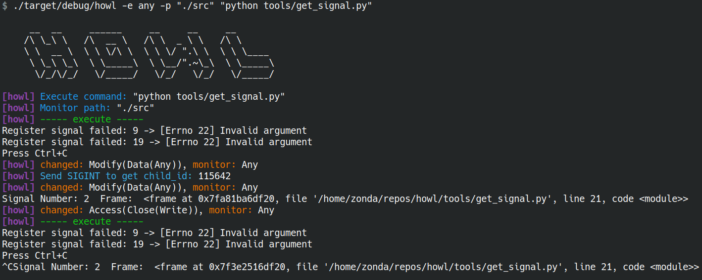

# Howl

## Introduce

Easy to use live-reload watchdog



## Usage

```shell
Easy to use live-reload watchdog

Usage: howl [OPTIONS] <EXECUTE>

Arguments:
  <EXECUTE>

Options:
  -e <FILE_EVENT>      [default: modify] [possible values: access, create, modify, remove, any]
  -p <PATH>            [default: .]
  -s <SIGNAL>          [default: SIGINT]
  -h, --help           Print help
  -V, --version        Print version

```

```shell
howl -e any -p "./src" "python tools/get_signal.py"
```
